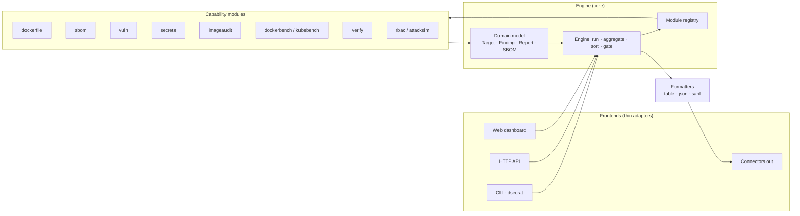

# Feature docs

One doc per feature, each explaining *how it works* with Mermaid diagrams. Diagrams render on GitHub and in
most Markdown viewers.

## How the whole system fits together

The rule: **one engine, many frontends.** Every capability is a module that reads a `Target` and returns
`Finding`s; the moment it registers, it shows up in the CLI, HTTP API, web UI, and connectors for free.

## Index

| Feature | Doc | Domain | Status |
|---|---|---|---|
| Engine & data model | [engine.md](engine.md) | — | ✅ |
| Frontends (CLI/HTTP/Web) | [frontends.md](frontends.md) | — | ✅ |
| Connectors (out) | [connectors.md](connectors.md) | — | ✅ |
| Dockerfile static analysis | [dockerfile.md](dockerfile.md) | 3 | ✅ |
| SBOM generation | [sbom.md](sbom.md) | 1 | ✅ |
| Vulnerability scanning | [vuln.md](vuln.md) | 2 | ✅ |
| Secret detection | [secrets.md](secrets.md) | 7 | ✅ |
| Built-image CIS audit | [imageaudit.md](imageaudit.md) | 3,10 | ✅ |
| Compliance benchmarks | [compliance.md](compliance.md) | 10 | ✅ |
| Supply-chain (sign/verify/attest/registry) | [supplychain.md](supplychain.md) | 9,13 | ✅ |
| Identity / RBAC risk | [rbac.md](rbac.md) | 15 | ✅ |
| Attack simulation (validation) | [attacksim.md](attacksim.md) | 14 | ✅ |
| Policy & admission | [policy.md](policy.md) | 8 | ✅ |
| Runtime detection (eBPF) | [runtime.md](runtime.md) | 4,5,11 | ✅ |
| Network egress control | [network.md](network.md) | 6 | ✅ |
| Sandboxing & hardening | [sandbox.md](sandbox.md) | 12 | ✅ |
| Platform (store/MCP/plugins) | [platform.md](platform.md) | all | ✅ |

✅ = built, tested, registered. Every capability domain has a registered module —
`dsecrat modules` lists them all. Additional gates (license policy, malware layer
scan, offline Kubernetes-manifest lint, cloud-IAM risk, and the Docker daemon
authorization plugin) register alongside these.
