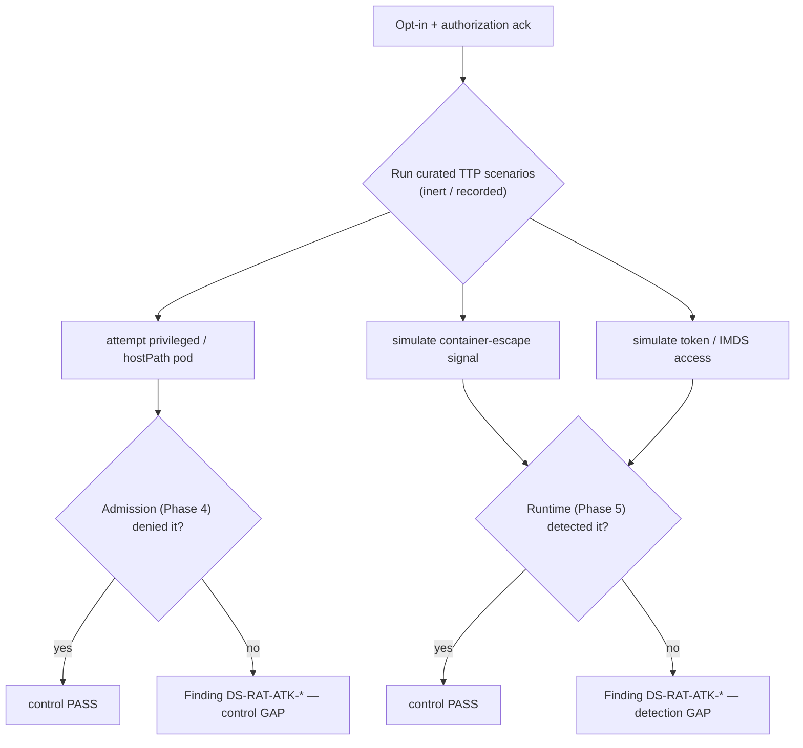

# Attack simulation (control validation)

**What:** a safe, opt-in adversary-emulation harness that *validates* your defenses actually fire — it runs
ATT&CK-for-Containers scenarios and asserts that admission/detection controls respond. It is validation, **not**
a live exploit kit. **Where:** `internal/attacksim/`, `internal/modules/attacksim/`. **Domain:** 14.
**Rule IDs:** `DS-RAT-ATK-*`.

## How it works



## The idea
Untested controls are assumptions, not defenses. This harness maps each scenario to a MITRE ATT&CK technique,
runs it safely, and checks whether the expected admission deny or runtime detection *actually happened*. A
missing response becomes a finding — so control regressions surface before an attacker finds them.

## Safety
- **Opt-in only**, gated behind an explicit authorization acknowledgement.
- Scenarios are **inert/recorded** — no destructive payloads; nothing runs live in CI.
- Consumes the Phase 4 (admission) and Phase 5 (runtime) interfaces; runs against them or their stubs.

## Try it
```sh
dsecrat scan --modules attacksim --confirm-authorized <target>
```
*Status: built + integrated; scenarios validate that a deny/detection fires against Phase 4/5 (or stubs).*
