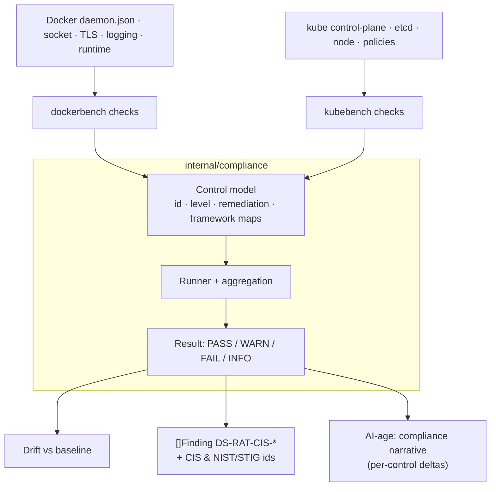

# Compliance benchmarks

**What:** assesses a Docker host/daemon and a Kubernetes cluster against CIS Benchmarks, mapped to NIST 800-190
and STIG, producing auditor-ready, control-by-control results. **Where:** `internal/compliance/` (shared
machinery), `internal/modules/dockerbench/`, `internal/modules/kubebench/`. **Domain:** 10. **Rule IDs:** `DS-RAT-CIS-*`.

## How it works



## What it does
- **CIS Docker Benchmark:** host, daemon config, config-file permissions, and runtime controls.
- **CIS Kubernetes Benchmark:** control-plane, etcd, worker-node, and policy controls, with version/profile handling.
- **Framework mapping:** each control cites its CIS id **and** a NIST 800-190 / STIG mapping, so one scan feeds
  multiple audits.
- **Drift reporting:** compares against an approved baseline and flags the specific control that regressed.
- **Waivers:** documented, expiring exceptions.

Assessment is strictly **read-only** — it never mutates the host or cluster — and runs offline against supplied
config/fixtures in tests.

## Try it
```sh
dsecrat scan --modules dockerbench /path/to/docker/config
dsecrat scan --modules kubebench   /path/to/kube/objects
```
*Status: built + integrated; results tested against committed fixtures.*
