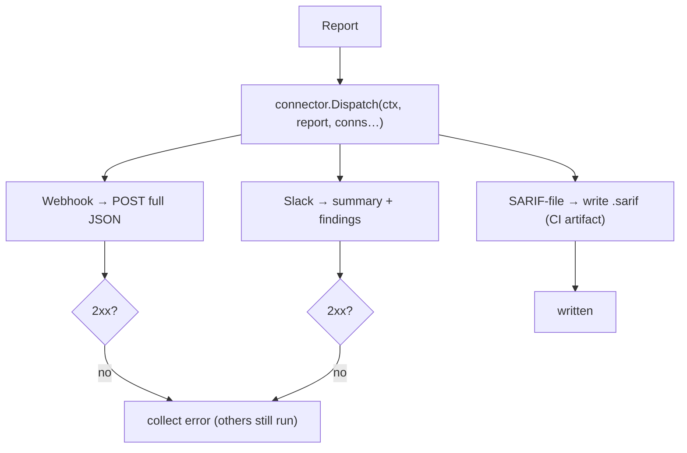

# Connectors (push results out)

**What:** deliver a finished `Report` to an external destination. A connector is an outbound adapter — one
interface, many targets. **Where:** `internal/connector/`.

## How it works



## The contract
```go
type Connector interface {
    Name() string
    Send(ctx context.Context, r *engine.Report) error
}
```
`Dispatch` sends to every configured connector and collects errors so one failing destination never stops the
others. Adding Jira / SIEM / MCP is a new file implementing this interface — nothing else changes.

## Try it
```sh
dsecrat scan --sarif-out report.sarif  <target>   # CI artifact / code scanning
dsecrat scan --webhook https://ci/hook <target>   # POST full JSON report
dsecrat scan --slack   https://hooks.slack.com/…  <target>
```
Flags compose: one scan can print a table, write SARIF, **and** notify Slack at once.

*Status: webhook, Slack, and SARIF-file connectors built + tested (httptest + tempfile). Jira/SIEM/MCP are
planned in the platform phase.*
