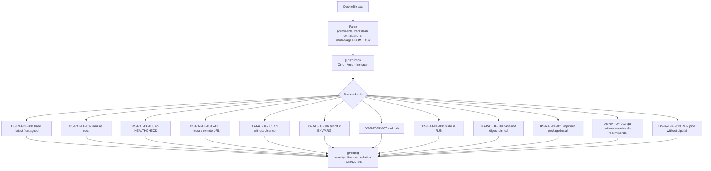

# Dockerfile static analysis

**What:** lints a Dockerfile against best-practice and CIS build controls before an image is ever built — the
cheapest place to catch risk. **Where:** `internal/modules/dockerfile/`. **Domain:** 3. **Rule IDs:** `DS-RAT-DF-*`.

## How it works



## Rules

| Rule | Severity | Catches |
|---|---|---|
| DS-RAT-DF-001 | HIGH | base image `:latest` or untagged (non-reproducible) |
| DS-RAT-DF-002 | HIGH/MEDIUM | explicit root `USER` / no `USER` set (CIS-DI-0001) |
| DS-RAT-DF-003 | LOW | missing `HEALTHCHECK` (CIS-DI-0006) |
| DS-RAT-DF-004 | MEDIUM/LOW | `ADD` from URL / `ADD` instead of `COPY` |
| DS-RAT-DF-005 | LOW | `apt-get install` without cache cleanup |
| DS-RAT-DF-006 | HIGH | secret-looking `ENV`/`ARG` (CIS-DI-0010) |
| DS-RAT-DF-007 | MEDIUM | remote script piped into a shell |
| DS-RAT-DF-008 | LOW | `sudo` inside `RUN` |
| DS-RAT-DF-010 | INFO | base tagged but not `@sha256` digest-pinned |
| DS-RAT-DF-011 | LOW | package install without a pinned version (DL3008/DL3018/DL3013) |
| DS-RAT-DF-012 | LOW | `apt-get install` without `--no-install-recommends` (DL3015) |
| DS-RAT-DF-013 | LOW | `RUN` uses a shell pipe without `pipefail` set (DL4006) |

Multi-stage is understood: `FROM build` referencing a prior `AS build` stage is **not** flagged as untagged.

## Try it
```sh
dsecrat scan examples/Dockerfile.bad            # table
dsecrat scan --format sarif examples/Dockerfile.bad
dsecrat scan --fail-on high examples/Dockerfile.bad   # exit 1 if a HIGH+ exists (CI gate)
```

**Verified:** 13 unit tests pass; a bad fixture yields 11 dockerfile findings (14 findings across all modules on a full `dsecrat scan`), a hardened one yields none above INFO.
