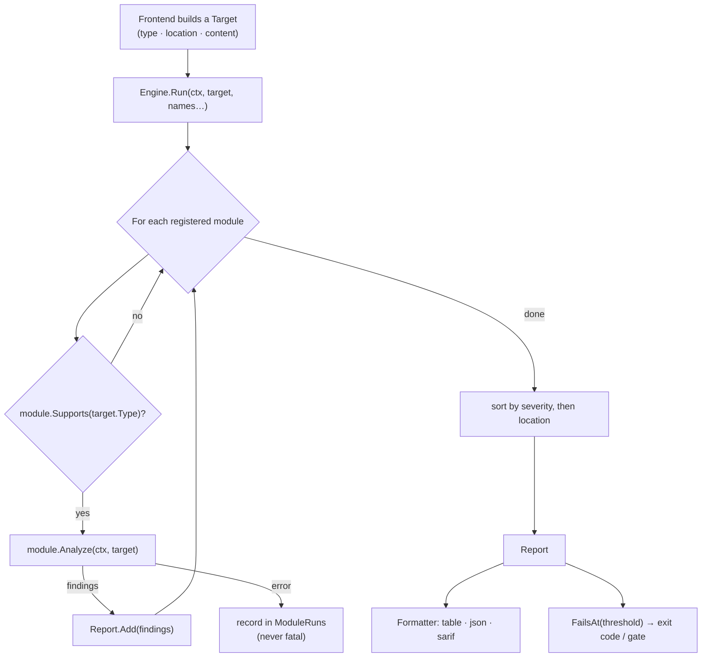
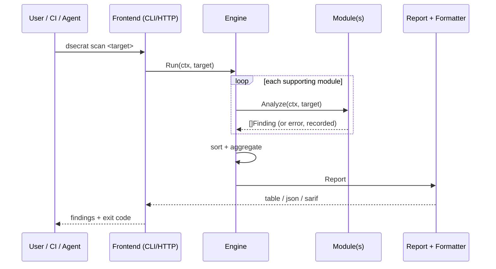

# Engine & data model

**What:** the core that every frontend and module depends on. It defines the analysis `Target`, the unified
`Finding`/`Report` model, the `Module` plugin interface, and the `Engine` that runs modules and aggregates
results. **Where:** `internal/engine/`.

## The run pipeline

## How a scan flows through the parts

## The data model (stable contract)

- **Target** — `{ Type; Location; Content; Metadata }`. Types: `dockerfile · image · filesystem · container · registry`.
- **Finding** — `{ RuleID; Module; Severity; Title; Description; Resource; Location; Remediation; References; Metadata }`.
- **Severity** — ordered: `Info < Low < Medium < High < Critical` (so sorting and gating are numeric).
- **Report** — findings + per-module run records; helpers `Counts()`, `Highest()`, `FailsAt(threshold)`.
- **Module** — `Name · Description · Domains · Supports(TargetType) · Analyze(ctx, *Target) ([]Finding, error)`.

## Why it's shaped this way
- **Isolation:** a module knows nothing about CLI/HTTP; a frontend knows nothing about scanning. Either side
  changes without touching the other.
- **Uniformity:** every capability produces the same `Finding`, so one formatter, one gate, one connector path
  serves all of them.
- **Resilience:** a failing module is recorded, never fatal — coverage degrades gracefully, never silently.
