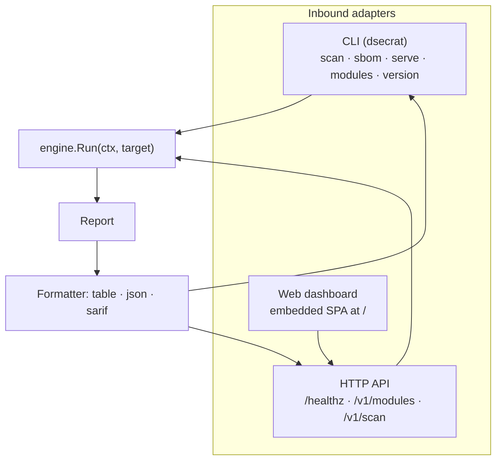
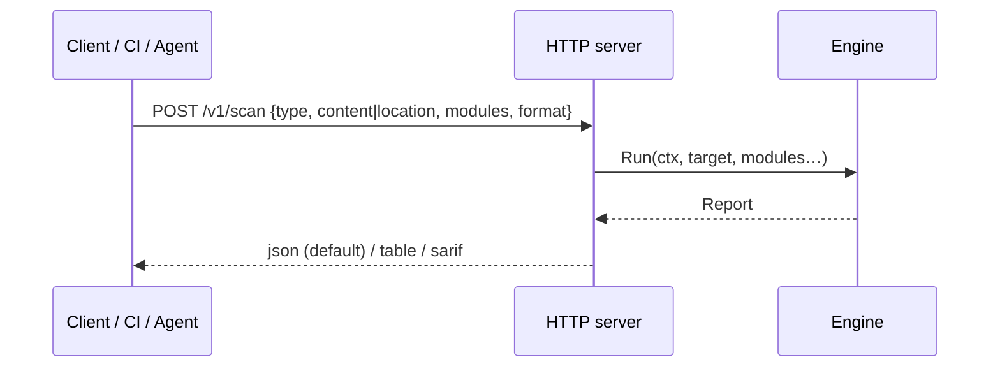

# Frontends (CLI · HTTP · Web)

**What:** three interchangeable ways to drive the same engine. Nothing analysis-related lives here — frontends
only build a `Target`, call the engine, and render the `Report`. **Where:** `internal/cli/`, `internal/server/`,
`internal/web/`.

## One engine, three faces



## CLI
```sh
dsecrat scan  [--format table|json|sarif] [--modules a,b] [--fail-on high] <target>
dsecrat sbom  [--format cyclonedx|spdx] [--out file] <image|path>
dsecrat serve [--addr :8080]
dsecrat modules      # list capabilities
dsecrat version
```
`--fail-on` turns any scan into a CI gate (non-zero exit at/above a severity).

## HTTP API

`GET /healthz`, `GET /v1/modules`, `POST /v1/scan`. Same results as the CLI, by construction.

## Web dashboard
A self-contained single-page app embedded in the binary (`go:embed`) — no CDNs, works offline. Paste a
Dockerfile, pick modules, get findings ranked with severity badges. It is just a client of `/v1/scan`.

```sh
dsecrat serve --addr :8080   # open http://localhost:8080/
```
