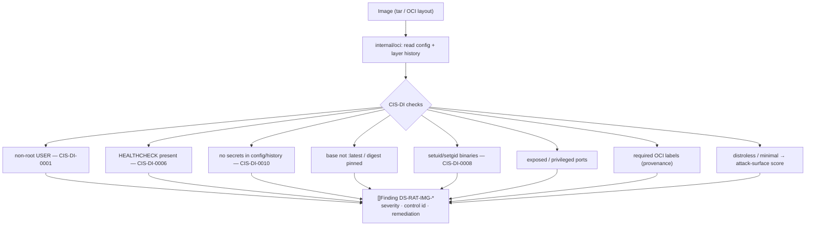

# Built-image CIS audit

**What:** audits a *built image's* config and layer history against CIS Docker Benchmark image controls — works
on any image, even one with no Dockerfile. **Where:** `internal/modules/imageaudit/`. **Domains:** 3, 10.
**Rule IDs:** `DS-RAT-IMG-*`.

## How it works



## Why it exists next to the Dockerfile linter
The Dockerfile linter audits the *recipe*; this audits the *artifact*. Most production images are pulled, not
built locally, and many ship without a Dockerfile — this covers them, and catches drift between recipe and
result.

## What it checks
Non-root user, HEALTHCHECK, secrets in config/history, base-image tag/digest hygiene, setuid/setgid binaries,
exposed/privileged ports, sensitive volumes, provenance labels, and a distroless/minimal attack-surface signal —
each mapped to a CIS-DI control id in the finding's references.

## Try it
```sh
docker save myapp:1.2.3 -o myapp.tar
dsecrat scan --modules imageaudit myapp.tar
```
*Status: built + integrated; CIS-DI results tested against committed image fixtures.*
