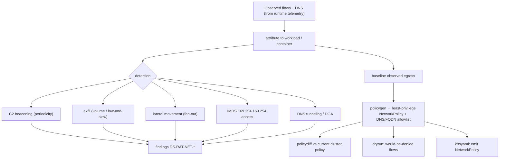

# Network egress control

**What:** analyzes per-workload network flows, detects malicious/anomalous egress, and **generates
least-privilege NetworkPolicy** from observed traffic. Advises and generates — it does not replace the CNI.
**Where:** `internal/netmon/`, `internal/modules/netpolicy/`. **Domain:** 6. **Rule IDs:** `DS-RAT-NET-*`.

## How it works



## What it does
- **Detects** (rules `DS-RAT-NET-010…016`): beaconing, exfil, lateral movement, IMDS access, DNS tunneling — over
  attributed flows.
- **Generates** (`policygen.go`, `k8syaml.go`, rules `DS-RAT-NET-020/021`): a least-privilege Kubernetes
  NetworkPolicy + DNS/FQDN egress allowlist from the observed baseline — advisory, never auto-applied.
- **Diffs & dry-runs** (`policydiff.go`, `dryrun.go`): compares generated policy to current and reports which
  flows a policy *would* deny before you enforce it.

## Rules (`DS-RAT-NET-*`)
`DS-RAT-NET-000` (engine), `001/002/003` (posture: default-deny missing, host-network, free ICC), `010–016`
(detections), `020/021` (generated-policy coverage), `030` (mTLS/encryption), `099` (summary).

## Try it
```sh
dsecrat scan --modules netpolicy <flows-fixture>   # detect + generate (offline)
```
**Status:** built + integrated; detection + policy-generation tested against recorded flow fixtures
(`netpolicy_test.go`, `policygen_test.go`). Consumes runtime telemetry (domain 6 ↔ domain 4/5/11).
