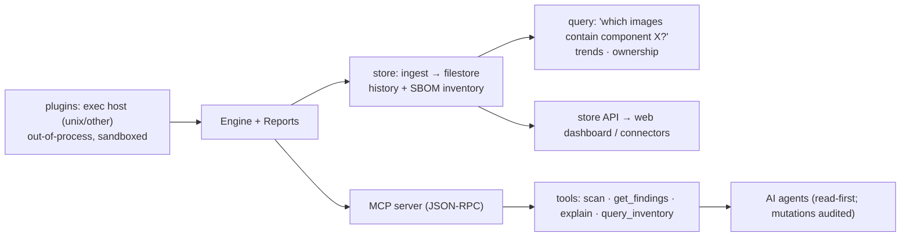

# Platform — store · MCP · plugins

**What:** the platform layer that turns the CLI into an agent-native, extensible system: a findings/SBOM
**store** for history + blast-radius queries, an **MCP server** so AI agents can drive and reason about
security posture, and a **plugin** runtime so the ecosystem extends the tool without forking. **Where:**
`internal/store/`, `internal/mcp/`, `internal/plugin/`. **Rule IDs:** `DS-RAT-PLT-*`.

## How it fits



## The three pieces
- **Store** (`internal/store`: `ingest.go`, `filestore.go`, `query.go`, `api.go`, `wire.go`) — opt-in
  persistence of findings + SBOM inventory. Answers the zero-day question **"which stored images contain
  component X at version Y?"** (blast radius) plus trends/ownership. Default stays stateless; server mode
  enables it.
- **MCP server** (`internal/mcp`: `jsonrpc.go`, `tools.go`, `explain.go`, `transport.go`, `audit.go`) — the
  agent-native interface. Exposes tools like `scan`, `get_findings`, `explain`, `query_inventory` over MCP so
  an AI agent can *reason about and act on* posture. **Read-first**; mutating calls are audited (`audit.go`).
- **Plugins** (`internal/plugin`: `exec.go`, `exec_unix.go`, `exec_other.go`, `host.go`) — an out-of-process
  plugin runtime; a plugin's output projects into `engine.Finding` like any module. Extend detection without
  touching core.

## Why this is the AI-age headline
Security posture becomes something an **agent** can query, explain, and remediate over a standard protocol
(MCP) — while the deterministic scan core still runs with no model or agent present. Plugins make the tool a
platform others build on.

## Try it
```sh
dsecrat serve                    # store + API + dashboard
# MCP server exposes scan/get_findings/explain over JSON-RPC (see internal/mcp/command.go)
```
**Status:** built + integrated; store, MCP tools, and plugin host tested (`store_test.go`, `mcp_test.go`,
`plugin_test.go`). Deterministic core unaffected when the platform layer is off.
