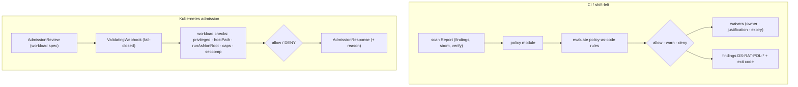

# Policy & admission

**What:** enforce security policy-as-code in two places — a CI gate over scan results, and a Kubernetes
admission webhook that blocks bad workloads before they run. **Where:** `internal/policy/`,
`internal/modules/policy/`, `internal/admission/`. **Domain:** 8. **Rule IDs:** `DS-RAT-POL-*`.

## How it works



## Two enforcement points
- **CI gate** (`internal/modules/policy`): runs policy over a scan `Report` — allow/warn/deny with governed
  **waivers**. Wire into CI to block merges/pushes that violate policy.
- **K8s admission** (`internal/admission`): a ValidatingWebhook (`server.go`, `review.go`, `workload.go`) that
  evaluates a pod/workload spec (privileged, hostPath, host namespaces, runAsNonRoot, dropped caps, seccomp)
  and returns allow/deny — **fail-closed**, with recorded-AdmissionReview fixtures for offline tests.

## Rules (`DS-RAT-POL-*`)
Policy verdicts and gate outcomes: `DS-RAT-POL-000` (engine), `DS-RAT-POL-001/002` (allow/deny outcomes),
`DS-RAT-POL-100/101` (rule violations), `DS-RAT-POL-110` (waiver applied/expired). Rules reference upstream findings
(e.g. `DS-RAT-VULN-*`, `DS-RAT-SUP-*`) so "deny if any HIGH CVE and unsigned" is one policy over the unified model.

## Try it
```sh
dsecrat compliance scan ...            # policy feeds compliance too
dsecrat scan --modules policy <target> # gate a report
# admission webhook runs as a server; tested via recorded AdmissionReview fixtures
```
**Status:** built + integrated; deterministic, offline, tested (`module_test.go`, `admission/*_test.go`).
