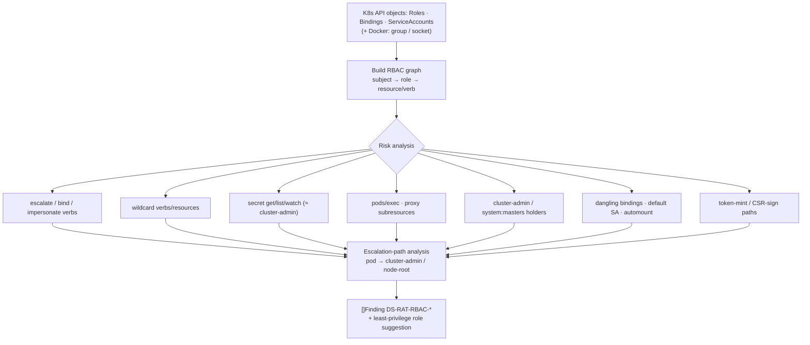

# Identity / RBAC risk

**What:** analyzes Kubernetes (and Docker) identity and RBAC for over-privilege and privilege-escalation paths —
the most common route from a compromised pod to cluster/cloud takeover. **Where:** `internal/rbac/`,
`internal/modules/rbac/`. **Domain:** 15. **Rule IDs:** `DS-RAT-RBAC-*`.

## How it works



## What it does
- Builds a subject→permission graph and answers reverse queries ("who can do X on Y").
- Flags the classic escalation levers: `escalate`/`bind`/`impersonate`, wildcards, secret readers, `pods/exec`,
  proxy subresources, cluster-admin holders, dangling bindings, default-SA usage + automounted tokens,
  token-mint and CSR-signing paths.
- Traces multi-step **escalation paths** (pod → cluster-admin / node-root).
- Suggests least-privilege roles from observed/needed usage.

Analysis is pure over supplied API-object fixtures — no live cluster needed in tests.

## Try it
```sh
dsecrat scan --modules rbac /path/to/kube/rbac/objects
```
*Status: built + integrated; tested against a labeled cluster fixture.*
