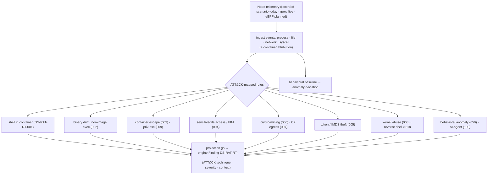

# Runtime threat detection

**What:** detects malicious behavior in running containers — mapped to MITRE ATT&CK for Containers — from
node telemetry, and projects each detection into the unified report. **Where:** `internal/runtime/`,
`internal/modules/runtime/`, `cmd/dsecrat-runtime/` (the node daemon). **Domains:** 4, 5, 11. **Rule IDs:** `DS-RAT-RT-*`.

## How it works



## Event sources (three forms, honestly scoped)
- **Offline replay (works today):** `internal/modules/runtime` is a `Module` that **replays recorded node
  telemetry** (scenarios in `testdata/`) and reports detections in a normal scan report — so detection logic
  is testable offline on any platform, and the same rules drive the live daemon. `cmd/dsecrat-runtime replay`
  runs the identical engine over a recorded stream with response, forensics, incidents, and profile generation.
- **Live `/proc` capture (planned — Track B):** on Linux, `cmd/dsecrat-runtime run` will watch the host via
  `/proc` + `/sys/fs/cgroup` polling and container-runtime attribution (stdlib only, no kernel deps). It
  samples state, so it targets exec/drift/shell/reverse-shell/network detections; a process that starts and
  exits between polls can be missed.
- **eBPF/CO-RE capture (planned — Track F, dependency-gated):** the deepest sensor (complete syscall/file
  coverage, no missed short-lived processes, in-kernel enforcement) requires an approved eBPF dependency.
  Until then the `run` path returns a clean error pointing at replay/`/proc`.

## Rules (`DS-RAT-RT-*`)
- `DS-RAT-RT-000` — module **summary** finding (INFO), not a detection rule.
- `DS-RAT-RT-001..010` — core ATT&CK techniques: shell (001), binary drift (002), container escape (003),
  sensitive-file/FIM (004), credential/token/IMDS theft (005), crypto-mining (006), C2 egress (007), kernel
  abuse (008), priv-esc (009), reverse/bind shell (010).
- `DS-RAT-RT-050` — behavioral anomaly (opt-in; needs a learned baseline).
- `DS-RAT-RT-100` — AI-agent runtime abuse (opt-in).
- `DS-RAT-RT-011..014` — **planned (runtime-gaps plan):** persistence (011), fileless exec (012),
  runtime-binary/runc-escape tamper (013), threat-intel IOC match (014).

Findings carry the ATT&CK technique id in references.

## Design note
Detection is **deterministic over an event stream** — every rule is a pure function of `(Event, State)`, reading
neither the wall clock nor a random source, so the same recorded stream yields byte-identical detections. The
module replays recorded telemetry (tests need no live kernel); the live daemon feeds the identical rules real
node events. Response is **planning-only today** (the engine plans `kill`/`quarantine` actions and records
intent); executing them against a live workload is the response side (Track C, domains 5/11), double-gated
behind enforce mode + an explicit acknowledgement. Forensic capture-on-alert (tamper-evident bundles) is built.

## Try it
```sh
dsecrat scan --modules runtime <recorded-scenario>   # replay + detect (offline)
dsecrat-runtime replay <scenario.json>               # full daemon over recorded telemetry
# live (Linux, planned): dsecrat-runtime run
```
**Status:** detection engine + offline replay built, integrated, and tested (`runtime_test.go`). Live `/proc`
capture, response execution, alert outputs, and deploy assets are tracked in the runtime-gaps plan. eBPF live
capture is dependency-gated.
