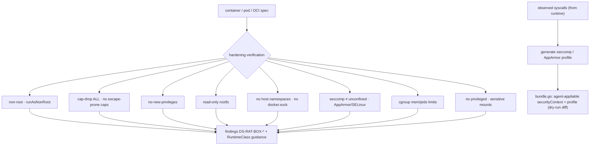

# Sandboxing & hardening

**What:** verifies a container/pod/OCI spec's runtime confinement posture and **generates least-privilege
profiles** (seccomp, AppArmor/SELinux) — plus an agent-appliable hardening bundle. Orchestrates existing
runtimes (gVisor/Kata) via RuntimeClass; it is not a new sandbox kernel. **Where:** `internal/harden/`,
`internal/modules/harden/`. **Domain:** 12. **Rule IDs:** `DS-RAT-BOX-*`.

## How it works



## What it does
- **Verify posture** (`harden.go`, rules `DS-RAT-BOX-001…020`): checks the full least-privilege control set —
  non-root, cap-drop-ALL, no-new-privileges, read-only rootfs, no host ns, no `docker.sock`, seccomp/AppArmor
  applied, cgroup limits, no privileged, sensitive mounts, setuid neutralization.
- **Generate profiles**: least-privilege seccomp from observed syscalls; AppArmor/SELinux drafts.
- **Agent-appliable bundle** (`bundle.go`): a structured securityContext + profile set an AI platform agent can
  apply, with a dry-run diff of what it newly blocks (`DS-RAT-BOX-900`).
- **RuntimeClass guidance**: recommend runc vs gVisor vs Kata by workload trust level.

## Try it
```sh
dsecrat scan --modules harden <spec>          # verify posture
dsecrat harden ...                            # generate profile / bundle (see command.go)
```
**Status:** built + integrated; verification + profile generation tested (`harden_test.go`). Profile generation
consumes runtime-observed syscalls (domain 12 ↔ 4/5/11).
