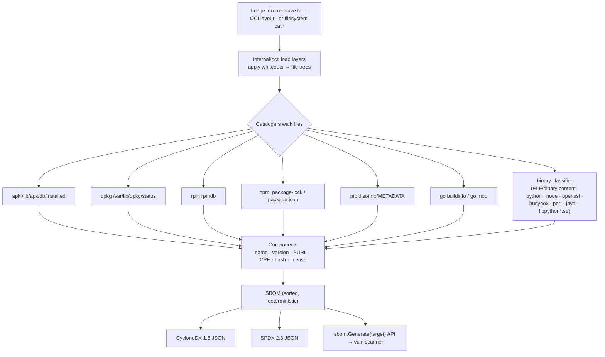

# SBOM generation

**What:** produces a Software Bill of Materials — the authoritative inventory of everything inside an image —
in SPDX and CycloneDX. It is also the input the vuln scanner consumes. **Where:** `internal/oci/`,
`internal/sbom/`, `internal/modules/sbom/`. **Domain:** 1. **Finding:** `DS-RAT-SBOM-001` (INFO summary).

## How it works



## Inputs → outputs
- **In:** an image (`docker save` tarball, OCI-layout tar/dir) or a filesystem path.
- **Out:** a standardized SBOM (CycloneDX or SPDX), plus the same inventory in the unified report and via the
  `sbom.Generate(target)` Go API for other modules.

## Package coverage

| Ecosystem | Source | PURL |
|---|---|---|
| Alpine (apk) | `/lib/apk/db/installed` | `pkg:apk/…` |
| Debian/Ubuntu (dpkg) | `/var/lib/dpkg/status` | `pkg:deb/…` |
| RHEL/Fedora (rpm) | rpmdb | `pkg:rpm/…` |
| npm | `node_modules`, `package-lock.json` | `pkg:npm/…` |
| Python | `*.dist-info/METADATA` | `pkg:pypi/…` |
| Go | executable buildinfo, `go.mod` | `pkg:golang/…` |
| Runtime binaries (content-classified) | ELF/binary contents of `python`/`node`/`openssl`/`busybox`/`perl`/`java`, incl. `libpython*.so` | `pkg:generic/…` |

The binary classifier (`internal/sbom/binclass.go`) fingerprints known interpreter/runtime binaries directly
from their file contents (filename-gated, then a version regex over the file's bytes), so a statically-linked
or hand-copied `python`, `node`, `openssl`, `busybox`, `perl`, or `java` binary — installed by copying a
prebuilt executable rather than through a package manager — is still cataloged with a real version. It also
recognizes `libpython<major.minor>.so*` shared libraries, since the distro's `python3.x` launcher is often a
thin stub while the actual CPython build (and the version its CVEs are filed against) lives in the shared
library. Go binaries compiled from source are separately identified via the Go build-info cataloger, which
reads the embedded module/version metadata that `go build` writes into every compiled binary.

**Determinism:** components are sorted; only the document timestamp/serial vary — the component set is byte-stable.

## Try it
```sh
docker save alpine:3.19 -o alpine.tar
dsecrat sbom --format cyclonedx alpine.tar > alpine.cdx.json
dsecrat sbom --format spdx     alpine.tar --out alpine.spdx.json
```
