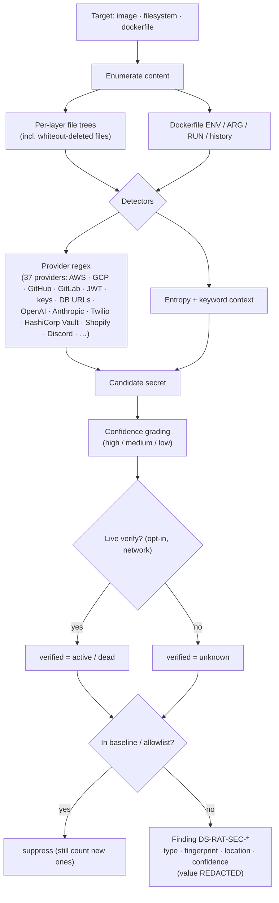

# Secret detection

**What:** finds credentials embedded in image layers (including files deleted in later layers), filesystems, and
Dockerfiles — with values redacted. **Where:** `internal/secrets/`, `internal/modules/secrets/`. **Domain:** 7.
**Rule IDs:** `DS-RAT-SEC-*`.

## How it works



## Key properties
- **Layer-aware:** scans each layer, including content removed by a later layer — a classic leak the naive
  "flattened image" scan misses.
- **Redaction first:** findings carry a type + fingerprint + location, never the secret value.
- **Baseline/allowlist:** accepted findings suppress with justification; *new* secrets still fire.
- **Optional live verification:** confirms whether a key is active vs dead, so real exposure ranks first
  (opt-in; never in tests).
- **Confidence grading:** every finding is tagged `high`/`medium`/`low` in `Metadata["confidence"]`. Provider
  regex hits are graded `high` when a matching provider keyword (e.g. "github", "stripe", "vault") appears in
  the surrounding context, `medium` otherwise; generic entropy/assigned-secret hits are graded `medium` or
  `low` based on the string's entropy and length. This ranks likely-real leaks above shape-only coincidences
  without dropping the lower-confidence ones.

## Provider coverage
Provider-specific regex detectors now span `DS-RAT-SEC-001`–`DS-RAT-SEC-044` (37 distinct providers), including AWS,
GCP, GitHub, GitLab, JWT, generic API keys/DB URLs, DigitalOcean, OpenAI, Anthropic, Hugging Face, Twilio,
HashiCorp Vault, Shopify, Discord, Telegram, PyPI, RubyGems, Square, Mailgun, Mailchimp, Grafana, Postman,
Airtable, Figma, Docker Hub, Sentry, and Mapbox. Two generic detectors round out the regex-based set:
`DS-RAT-SEC-014` (generic assigned secret) and `DS-RAT-SEC-015` (high-entropy string). Two additional heuristics catch
credentials that don't look like provider tokens: `DS-RAT-SEC-050` (weak/low-entropy hardcoded password) and
`DS-RAT-SEC-051` (credential embedded in an XML config file, e.g. Maven `settings.xml`).

## Try it
```sh
dsecrat scan --modules secrets <image.tar>
dsecrat scan --modules secrets examples/Dockerfile.bad
```
*Status: built + integrated; tests in `internal/secrets`.*
