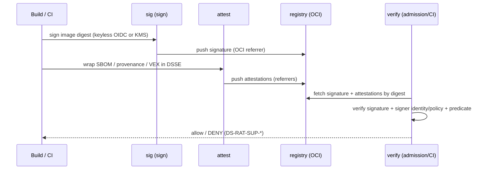
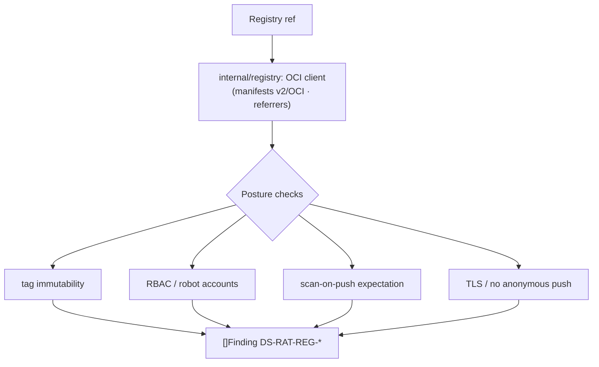

# Supply-chain integrity (sign · verify · attest · registry)

**What:** signs images/artifacts, attaches and verifies supply-chain attestations (SBOM, provenance, VEX), and
audits registry posture — a Sigstore/Cosign-style capability, re-implemented and offline-testable.
**Where:** `internal/sig/`, `internal/attest/`, `internal/registry/`, `internal/modules/verify/`,
`internal/modules/registry/`. **Domains:** 9, 13. **Rule IDs:** `DS-RAT-SUP-*`, `DS-RAT-REG-*`.

## Sign → attest → verify



## Registry posture audit



## What it does
- **Signing:** by image digest, keyless (OIDC-style) or KMS/keyed; signatures stored as OCI referrers.
- **Attestations:** SBOM, SLSA-style provenance, and VEX wrapped in DSSE/in-toto, attached by digest.
- **Verification:** checks signature **and** signer identity/policy and predicate — rejects tampered digests
  and unsigned images; the `verify` module fails findings for violations at CI or admission time.
- **Registry audit:** immutability, RBAC, TLS, scan-on-push, anonymous access.

Signing/verify round-trips against a **local registry + local trust root** in tests — no external network.

## Try it
```sh
dsecrat scan --modules verify <image-ref>
```
*Status: built + integrated (`sig`, `attest`, `registry` libs tested). Follow-ups: register the `registry`
module in the registry, module-level golden tests for `verify`, and any justified crypto dependency.*
