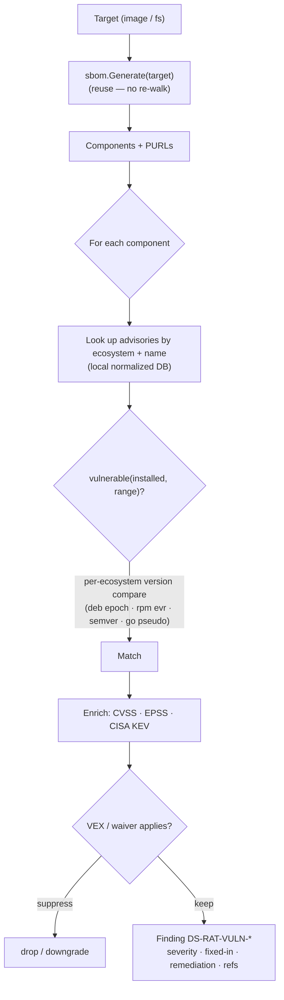
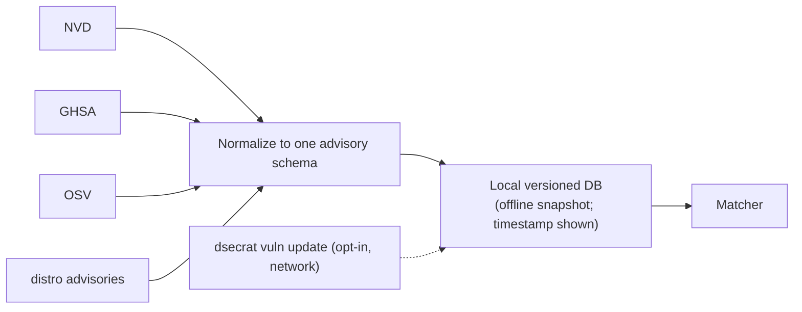

# Vulnerability scanning

**What:** matches the components in an SBOM against known advisories and ranks them by *real* risk — offline,
against a local advisory DB. **Where:** `internal/vulndb/`, `internal/modules/vuln/`. **Domain:** 2.
**Rule IDs:** `DS-RAT-VULN-*`.

## How it works



## Advisory data



## What it does
- Matches OS packages (apk/deb/rpm) and language deps (npm/pip/go/…) from the SBOM.
- **Per-ecosystem version-range comparison** — the make-or-break for precision (Debian epochs, RPM evr,
  semver pre-release, Go pseudo-versions).
- Enriches with CVSS + **EPSS** (exploit probability) + **CISA KEV** (known-exploited) for ranking.
- Applies **VEX** and waivers (with expiry) to cut non-applicable noise.
- Reports fixed vs unfixed with the fix version and an agent-consumable remediation.
- Fully **offline** against a pinned DB snapshot; DB build timestamp surfaced so staleness is visible.
- **Base-distro EOL:** flags a HIGH `DS-RAT-VULN-EOL` finding when the image's base distro release is past its
  published end-of-life date — no advisories are published for an EOL distro, so its OS-package results are
  incomplete by definition (ref: `NIST-SP-800-190`).

## Refreshing the DB
The DB used for a scan is resolved in this order: an explicit `--vuln-db <path>`, then `$DSECRAT_VULN_DB`, then
`~/.dsecrat/vulndb.json` if present, then the embedded snapshot.

To rebuild an on-disk DB from the public OSV per-ecosystem feeds:
```sh
dsecrat vuln update --ecosystems Debian,Alpine,PyPI --out ~/.dsecrat/vulndb.json
```
Once written to `~/.dsecrat/vulndb.json` (or pointed at via `$DSECRAT_VULN_DB`), every subsequent scan picks it up
automatically — no need to pass `--vuln-db` each time. `dsecrat vuln info` prints the active DB's advisory count,
build timestamp, source label, and age.

## Try it
```sh
dsecrat scan --modules vuln  <image.tar>
dsecrat scan --modules sbom,vuln --format json <image.tar>
dsecrat scan --vuln-db ~/.dsecrat/vulndb.json --modules vuln <image.tar>
```
*Status: built + integrated; module-level golden tests are a tracked follow-up (matcher logic is tested in
`internal/vulndb`).* 
