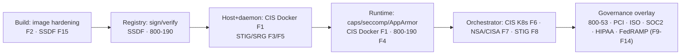

# Framework hardening playbooks

Practical, **technical** security best practices for every framework in the compliance register.
Not governance prose — concrete settings, flags, and checks, each tied to the `docker-security`
module that enforces or verifies it.

Each doc lists controls as: **the practice → the concrete technical setting → how we check it**.

## Docs

| # | Framework | Playbook | Depth |
|---|---|---|---|
| F1 | CIS Docker Benchmark | [cis-docker.md](cis-docker.md) | host · daemon · runtime |
| F2 | CIS-DI image build controls | [image-hardening.md](image-hardening.md) | image / Dockerfile |
| F3 | DISA STIG — Docker Enterprise 2.x | [stig-srg.md](stig-srg.md) | DoD daemon/platform |
| F5 | DISA Container Platform SRG | [stig-srg.md](stig-srg.md) | DoD platform |
| F4 | NIST SP 800-190 | [nist-800-190.md](nist-800-190.md) | container risk areas |
| F6 | CIS Kubernetes Benchmark v1.10 | [kubernetes.md](kubernetes.md) | control-plane · node · policy |
| F7 | NSA/CISA K8s Hardening v1.2 | [kubernetes.md](kubernetes.md) | orchestration |
| F8 | Kubernetes STIG | [kubernetes.md](kubernetes.md) | DoD orchestration |
| F15 | NIST SSDF (800-218) | [ssdf.md](ssdf.md) | secure build / supply chain |
| F9–F14 | 800-53 · PCI 4.0.1 · ISO 27001:2022 · SOC 2 · HIPAA · FedRAMP | [regulatory.md](regulatory.md) | container-technical subset |

## The layered mental model (build → runtime)

**Principle:** the technical frameworks (F1–F8, F15) define *what to configure*; the governance frameworks
(F9–F14) mostly *consume the same technical evidence* through a crosswalk. Harden once, prove many.

## Non-negotiable technical baseline (applies under every framework)
1. Run rootless / non-root `USER`; never `--privileged` in prod.
2. `--cap-drop=ALL`, add back only what's proven needed; `--security-opt=no-new-privileges`.
3. `seccomp` = RuntimeDefault (or tighter); AppArmor/SELinux enforced.
4. Read-only root fs; explicit tmpfs; resource + PID limits (cgroups v2).
5. No `docker.sock` mounted into containers; no host namespaces.
6. Images: pinned by digest, non-root, no secrets, minimal/distroless, scanned + signed.
7. TLS on the daemon socket; audit logging on; content trust / signature verification enforced.
