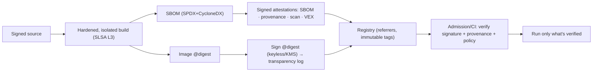

# F15 — NIST SSDF (SP 800-218) — secure build & supply chain

The Secure Software Development Framework. For containers this is the **build → registry → deploy** integrity
chain: know what's in the artifact, prove where it came from, and verify it before it runs. It underpins EO
14028, and its evidence feeds FedRAMP/PCI/SOC2 supply-chain expectations.

**Modules:** `sbom`, `vuln`, `secrets`, `sig`, `attest`, `verify`, `registry`.

## SSDF practice groups → container technical controls

### PO / PS — Protect the software & organization
| SSDF | Container control | Module |
|---|---|---|
| PS.1 Protect code integrity | sign commits/artifacts; protected pipelines | `sig`, `verify` |
| PS.2 Provide provenance | attach **SLSA provenance** (in-toto/DSSE) to each image | `attest` |
| PS.3 Archive & protect releases | immutable, digest-addressed images; signed SBOM retained | `registry`, `sbom` |

### PW — Produce well-secured software
| SSDF | Container control | Module |
|---|---|---|
| PW.4 Reuse secure components | scan dependencies; block vulnerable | `vuln`, `sbom` |
| PW.7/PW.8 Review & test | static analysis (Dockerfile/image), secret scan in CI | `dockerfile`, `imageaudit`, `secrets` |
| PW.9 Secure default config | non-root, cap-drop, read-only, distroless defaults | `imageaudit`, `harden` |

### RV — Respond to vulnerabilities
| SSDF | Container control | Module |
|---|---|---|
| RV.1 Identify vulns continuously | continuous re-scan of stored images; new-CVE alerts | `vuln` + store (planned) |
| RV.2 Assess & remediate | prioritized (KEV/EPSS), agent-appliable fixes, VEX | `vuln` |
| RV.3 Root-cause / prevent | base-image upgrade guidance; policy gates | `vuln`, `policy` |

## The integrity chain (what "good" looks like)

## Delivered vs planned
- **Delivered:** `sbom`, `vuln`, `secrets`, `sig`/`attest`/`verify`, `registry` — and an `nist-ssdf` **control
  pack** already maps SBOM/vuln/secrets/verify **evidence** onto SSDF practices.
- **Deepening:** continuous re-scan + blast-radius (needs the platform store), reproducible builds, VSA-gated
  deploys.

**Practical stance:** SSDF = "sign everything, attest everything (SBOM/provenance/scan/VEX), verify before run,
and never stop scanning what you shipped." The evidence this produces is reused by every governance framework's
supply-chain requirement.
